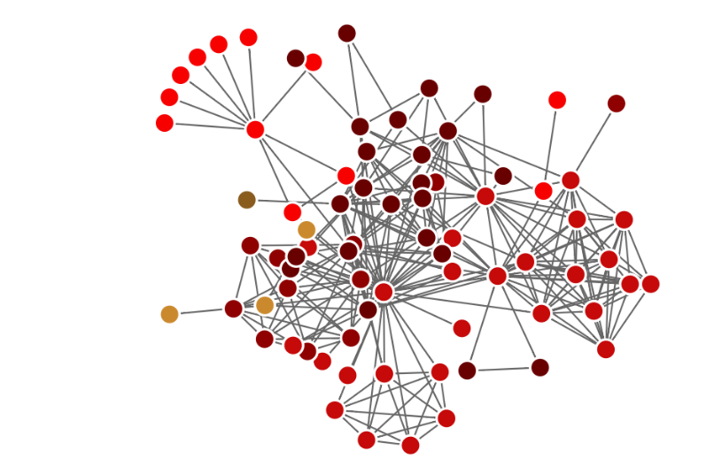
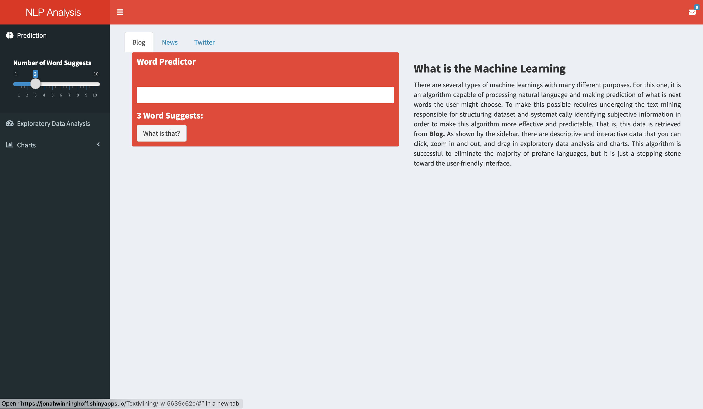

## **The Capstone Project**

The final capstone project is to create and devise an algorithm via machine learning to make word prediction similar to most message apps in iPhone and other smartphones. This project is of Johns Hopkins Data Science Specialization Program under Coursera in partnership with Swiftkey.  

This work is done solely using R programming language accompanied by Natural Language Processing (NLP) and several other techinques. More details can be seen in my [work](https://jonahwinninghoff.shinyapps.io/TextMining/#). Before you view my work, I would like you to go through this presentation in order to understand this better.

## **What does the dataset look like?** 

 Originally, this data is like a book with many gibberish and profane languages. It turns into the dataset with a number of words associated with next words called bigram, which can turn into a word network. What you see below is just a demonstration. As soon as this presentation is finished, you will see the real complex networks.

{width=50%}

## **How well does the algorithm perform?**

This algorithm manages to eliminate the majority of profane and gibberish words. It is not only able to predict the next word through many word sequences but capable of changing a number of word suggests. It is just a stepping stone toward user-friendly interface. The speed of this algorithm is considered to be at optimal level. 

## **Drawbacks and future improvements**

This algorithm gives no gurantee of predicting the next word that is grammarically correct. Not only that, it sometimes can be trapped in the same prediction cycle.

In future, this algorithm should be with grammar foundation and it should be able to make word prediction that relies on, rather than general population, demographic populace datasets without infringing ethical issues.

## **View my work**

The application can be seen 
**[here](https://jonahwinninghoff.shinyapps.io/TextMining/#)**. If you want to see how coding works, my GitHub page is **[here](https://github.com/jonahwinninghoff/Data-Science-Capstone.git)**.

